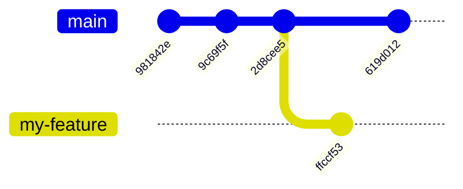
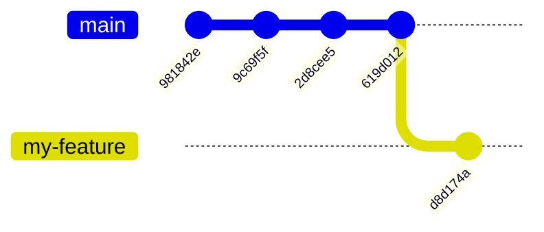
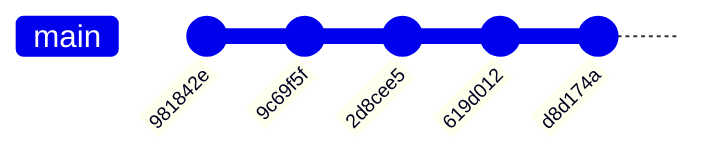
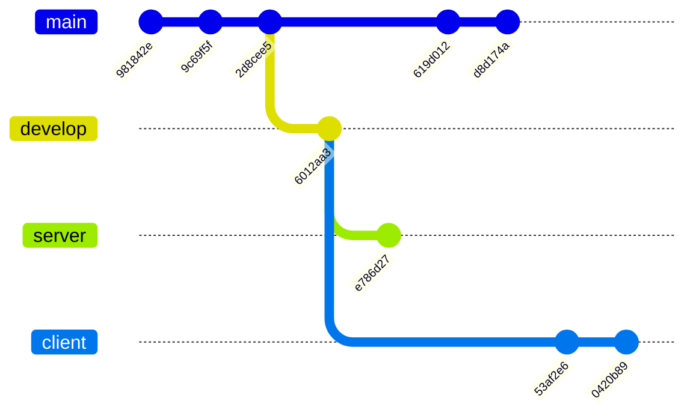
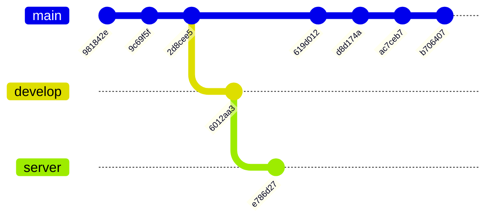

# Git

## Tags

[[Ref](https://git-scm.com/book/en/v2/Git-Basics-Tagging)]

- lightweight tag
  - `git tag 'just-a-label'`
  - detached mode
  - `git describe` only look for annotated tags:
    ```
    fatal: No annotated tags can describe 'a3b03454e26a4f45248b9b33dd98b0cf7311945c'.
    However, there were unannotated tags: try --tags.
    ```
  - `git describe --tags` will look for both annotated and lightweight tags
- annotated tag
  - `git tag -a 'v0.0.1'` with a commit message
  - `git describe`
    ```
    v0.0.1-1-ga3b0345
           ^   ^^^^
           |   hash
           |
           |-- how many commits since the tag
    ```
- tags are not pushed
  - `git push origin v0.0.1` to push a single tag
  - `git push --tags` to push all tags (annotated and lightweight)
  - `git push --follow-tags` to push commits and annotated tags

## Sign

- `git config --global tag.gpgSign`
- [https://docs.github.com/en/authentication/managing-commit-signature-verification/generating-a-new-gpg-key](https://docs.github.com/en/authentication/managing-commit-signature-verification/generating-a-new-gpg-key)
- [https://gist.github.com/paolocarrasco/18ca8fe6e63490ae1be23e84a7039374?permalink_comment_id=3767413#gistcomment-3767413](https://docs.github.com/en/authentication/managing-commit-signature-verification/generating-a-new-gpg-key)

## Stash

[[Ref](https://www.atlassian.com/git/tutorials/saving-changes/git-stash)]

## Rebase

**Goal**: replies commits on top of the new base.

`git log --oneline --graph --all`

```
* ffccf53 (HEAD -> my-feature) feat: add my-new-file.txt
| * 619d012 (master) chore: add README.md
|/  
* 2d8cee5 feat: add world.txt
* 9c69f5f feat: add hello.txt
* 981842e add gitignore
```



`git checkout my-feature && git rebase master`

```
* d8d174a (HEAD -> my-feature) feat: add my-new-file.txt
* 619d012 (master) chore: add README.md
* 2d8cee5 feat: add world.txt
* 9c69f5f feat: add hello.txt
* 981842e add gitignore <-- NEW HASH <=> NEW COMMIT
```



`git checkout master && git merge my-feature`

Using fast-forward merge, the history will be linear:

```
Updating 619d012..d8d174a
Fast-forward
```

```
* d8d174a (HEAD -> master, my-feature) feat: add my-new-file.txt
* 619d012 chore: add README.md
* 2d8cee5 feat: add world.txt
* 9c69f5f feat: add hello.txt
* 981842e add gitignore
```



### Advanced

```
* 0420b89 (HEAD -> client) feat: add index.html
* 53af2e6 chore: prepare frontend folder
| * e786d27 (server) chore: prepare backend folder
|/  
* 6012aa3 (develop) chore: prepare web app folder
| * d8d174a (master) feat: add my-new-file.txt
| * 619d012 chore: add README.md
|/  
* 2d8cee5 feat: add world.txt
* 9c69f5f feat: add hello.txt
* 981842e add gitignore
```



We want to rebase `client` on top of `develop`:

`git rebase --onto master server client`

```
* b706407 (HEAD -> client) feat: add index.html
* ac7ceb7 chore: prepare frontend folder
* d8d174a (master) feat: add my-new-file.txt
* 619d012 chore: add README.md
| * e786d27 (server) chore: prepare backend folder
| * 6012aa3 (develop) chore: prepare web app folder
|/  
* 2d8cee5 feat: add world.txt
* 9c69f5f feat: add hello.txt
* 981842e add gitignore
```



:warning: do not rebase commits that have been pushed to a remote branch that others are using.

[[Ref](https://www.atlassian.com/git/tutorials/merging-vs-rebasing#the-golden-rule-of-rebasing)]

## Squash

## Bisection

```plaintext
* 9ce5358 (HEAD -> master, origin/master) refactor: clean structure
* 5264c8f more on git advanced
* a2f0a04 docs: add tags and sign
* ece0458 chore: improve readme
* 79900c2 added run
* e399d30 configure env variable with secret
* 99c627f add script for testing env variables with ci
* 9b1a2e8 (bug) refactor: introduce bug
* 060f2fe feat: add demo script
| * 88bc425 (origin/boh) boh
| * ba9b498 more on git advanced
| * 85d14f7 docs: add tags and sign
| * a3b0345 chore: improve readme
| | * 08b85b7 (origin/spe-lectures, spe-lectures) clean
| |/  
| * c52da85 (tag: v0.0.1) added run
| * 691a209 configure env variable with secret
| * b82db6c add script for testing env variables with ci
|/  
* 6b00722 (tag: just-a-label) add DS_Store to gitignore
* f4d975f fixed typo
* fe78a64 added example of uml schemas with mermaid
* 08342d4 from prof
* 0937b7d added matrix example
* e9d0282 added readme
* 13d86b0 default > basic
* 7844461 pull-request > pull_request
* 024d072 fixed typo
* f0d8189 fixed bug
* c627d33 added basic ci
* fd89689 fixed
* ac2a17e first commit
(END)
```

`9b1a2e8` introduces a bug:

- `git bisect start`
- `git bisect bad`
- `git bisect good ac2a17e` (a commit with a functioning code)
- bisection will use the binary search algorithm to find the commit that introduced the bug asking you, for each commit, if it's `good` or `bad`.
  - you have to test the code at each step
  - type `git bisect good` or `git bisect bad` until the bisection is complete
- at the end git will tell you the commit that introduced the bug

**A test is useful to automate the process (of course, when we have a bug 🐛 the first things we do is write a failing test, isn't it 😉)!**
