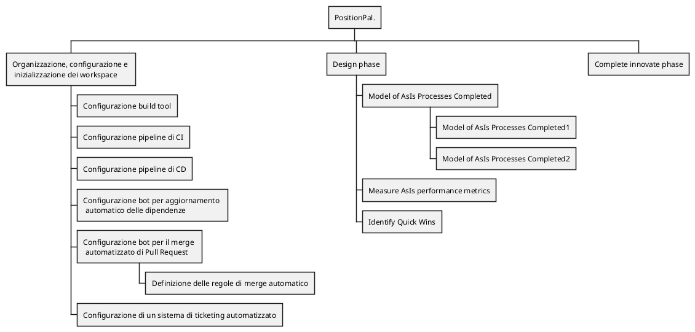

# WBS

```plantuml
@startwbs wbs

* PositionPal.

** Organizzazione, configurazione e \n inizializzazione dei workspace
*** Configurazione build tool
*** Configurazione pipeline di CI
*** Configurazione pipeline di CD
*** Configurazione bot per aggiornamento \n automatico delle dipendenze
*** Configurazione bot per il merge \n automatizzato di Pull Request
**** Definizione delle regole di merge automatico
*** Configurazione di un sistema di ticketing automatizzato

** Design phase
*** Model of AsIs Processes Completed
**** Model of AsIs Processes Completed1
**** Model of AsIs Processes Completed2
*** Measure AsIs performance metrics
*** Identify Quick Wins
** Complete innovate phase

@endwbs
```

Hello World
